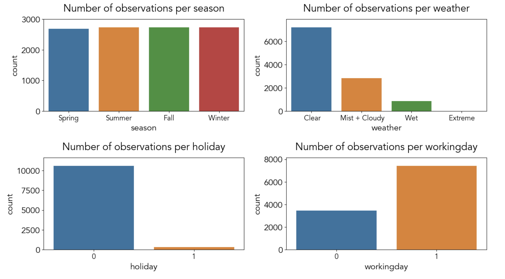
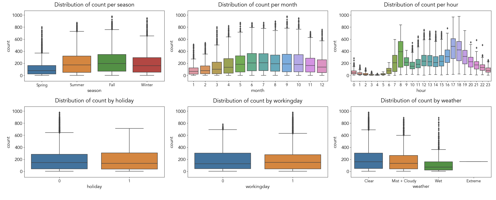
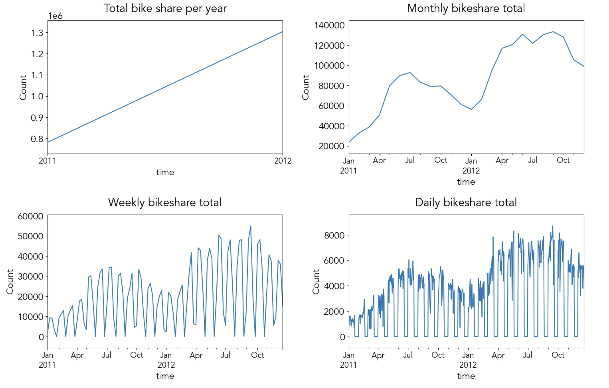
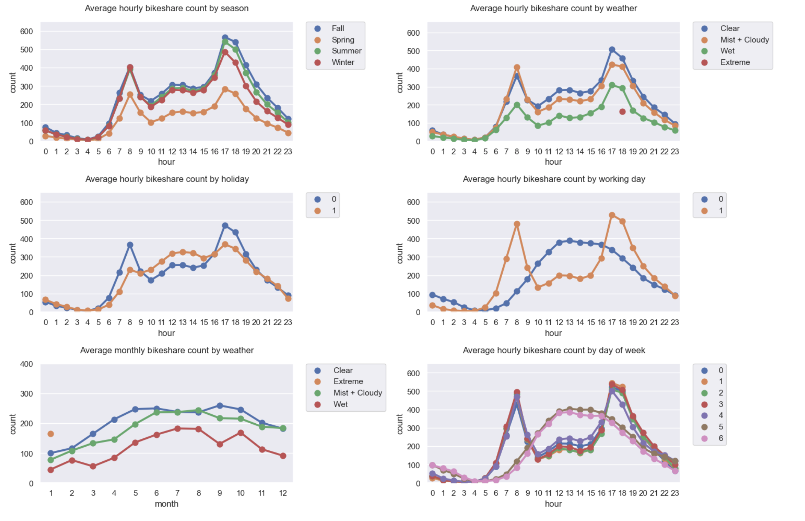
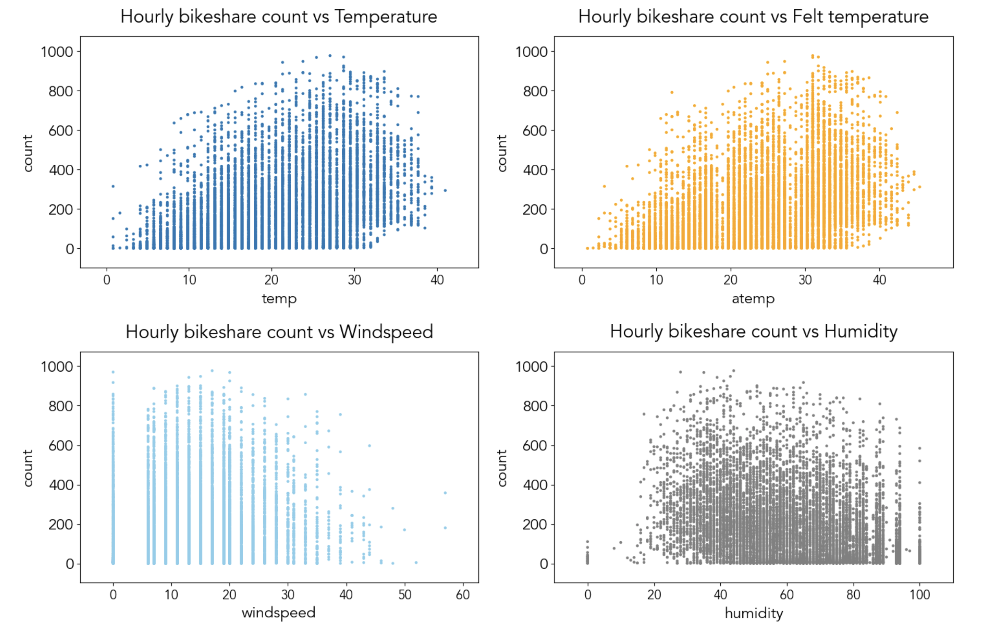

## Bike Sharing Demand Prediction 
https://www.kaggle.com/c/bike-sharing-demand

Bike sharing program is a transporation system that provides affordable access to bikes in urban areas. The data generated by bike sharing program can help researchers understand behaviors of bike share users and mobility patterns. The goal of this kaggle project is to combine historic bike share usage and weather data to predict bikeshare demand in Washington DC. 

## The data
### Data source
- The data was downloaded from '''Bike Sharing Demand''' competition on kaggle.com 
- There are total of 10886 rows of data, collected from 24 months period in Washington DC
- Each row contains bike usage count for 1 hour period and corresponding weather information
- Data for 4th week of every month is used as a test set, and prediction on test set is evaluated by RMSLE

### EDA

## Feature Selection

## Evaluation Metric

### Baseline Model
First, a simple linear regression model is used as a baseline model. 

### Linear regression with Ridge

### Linear regression with Lasso

### Random Forest Regression

### Gradient Boosting Regression

### Best Performing Model and Evaluation on Kaggle

### Next Steps

  
 
<b>Figure X.</b> cat

  
 
<b>Figure X.</b> Bar

  
 
<b>Figure X.</b> time

  
 
<b>Figure X.</b> point

  
 
<b>Figure X.</b> weather

  
 
<b>Figure X.</b> corr

