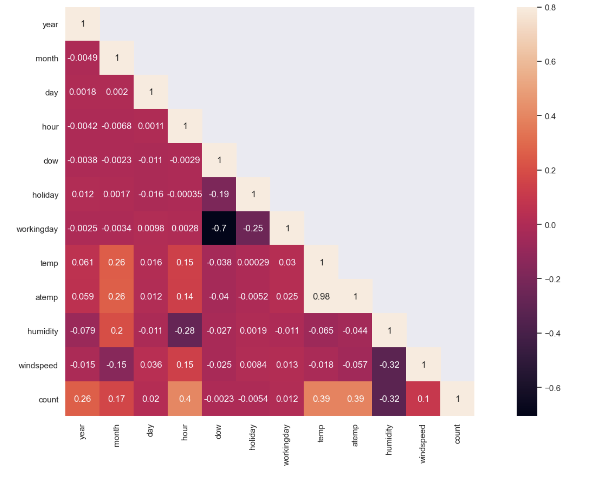

## Bike Sharing Demand Prediction 
https://www.kaggle.com/c/bike-sharing-demand

Bike sharing program is a transporation system that provides affordable access to bikes in urban areas. The data generated by bike sharing program can help researchers understand behaviors of bike share users and mobility patterns. The goal of this kaggle project is to combine historic bike share usage and weather data to predict bikeshare demand in Washington DC. 

## The data
### Data source
- The data was downloaded from '''Bike Sharing Demand''' competition on kaggle.com 
- There are total of 10886 rows of data, collected from 24 months period in Washington DC
- Each row contains bike usage count for 1 hour period and corresponding weather information
- Data for 4th week of every month is used as a test set, and prediction on test set is evaluated by RMSLE

### EDA

First, number of observations for categorical variables are explored. There are approximately equal number of observations for each season. In terms of weather, "clear" has the most observations, followed by "Misty + Cloudy" , "Wet", and very few "Extreme". And majority of observations were from non-holiday and working day.

  
 
<b>Figure X.</b> cat

Next, distribution of features were explored using barplots. Mean bike share count per hour was in order of Summer > Fall > Winter > Spring. In terms of months, June and July had the highest bikeshare demand and January, February, and March had the least bikeshare demand. While the average bikeshare demand was similar for holiday vs non-holiday and workday vs non-workday, there are higher number of outliers in non-holidays and workdays. In terms of weather conditions, clear day had the highest average bikeshare demand.

  
 
<b>Figure X.</b> Bar

By plotting the bike share count by time, it is evident that overall bikeshare demand has increased from 2011 to 2012, and summer months have the highest total number of bike shares. The 0 values in weekly and daily timeseries are the test set that is set aside by Kaggle for evaluation.

  
 
<b>Figure X.</b> time

By plotting the bike share count by hour, impact of features on hourly demand is clear. In terms of weather, Spring time has the least demand all across hours. While during morning commute hours(7-9am), demand in Summer, Fall, Winter were similar, during afternoon commute hours(4-7pm), demand varied for those seasons. On holidays and non-work days, there were less bike demand for commute hours, and more demand during the work hours compared to non-holidays and work days. Lastly, day of week (0-Monday, 5-Sunday) shows that bike demand pattern is drastically different on weekday vs weekends. Additionally, on weekdays, Monday and Friday have slightly different demand pattern compared to other weekdays. 

  
 
<b>Figure X.</b> point

From scattering plots of demand count vs weather, we see slight positive correlations with temperatures (both absolute and felt temperatures) and slight negative correlations with windspeed and humidity. Since temp and atemp have correlation value close to 1, one of the two features can be dropped for modeling. 

  
 
<b>Figure X.</b> weather

Lastly, correlation between features were visualized using a heatmap. Features hour,temperature, year, month have highest positive correlation with the count ( target variable), and humidity shows high negative correlation with the count. 

  
 
<b>Figure X.</b> corr

## Evaluation Metric
 Root mean square log error (RMSLE) is used as model evaluation metric. RMSLE gives extra penalty for underestimation compared to overeestimation. (In comparison, RMSE gives equal penalty for over and underestimation).

### Linear regression 
A simple linear regression model gives RMLSE = 0. 5878. 

### Linear regression with Lasso
A linear regression with Lasso regularization optimzed using grid search gives RMSLE = 0.629 (alpha = 0.01, max_iter = 100)

### Linear regression with Ridge
A linear regression with Ridge regularization optimzed using grid search gives RMSLE = 0.5788 (alpha = 0.18, max_iter = 100)

### Random Forest Regression
A random forest model was optimized with grid search, and the best RF model gives RMSLE = 0.3333 (n_estimators = 500, max_depth = None, min_samples_split = 2).

### Gradient Boosting Regression
A gradient boosting regression model was optimized with grid search, and the best GBR model gives RMSLE = 

### Best Performing Model and Evaluation on Kaggle
The best performing GBR model was used to make prediction on Kaggle test set. The RMSLE value was 0.38922, equivalnet to top 5% score on the leaderboard. 

